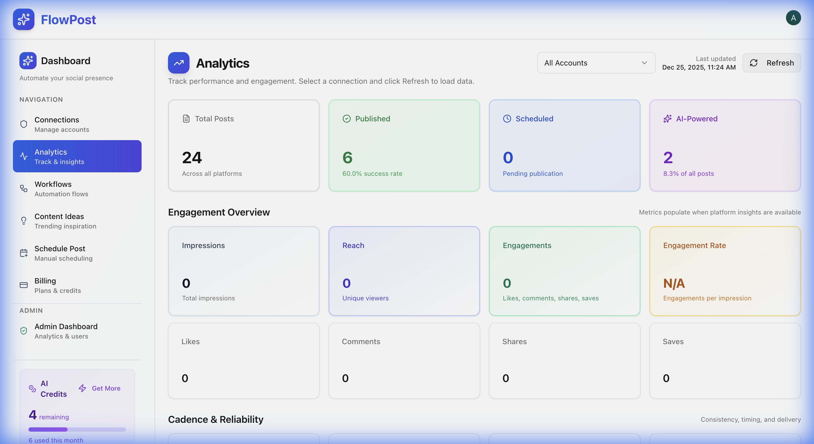
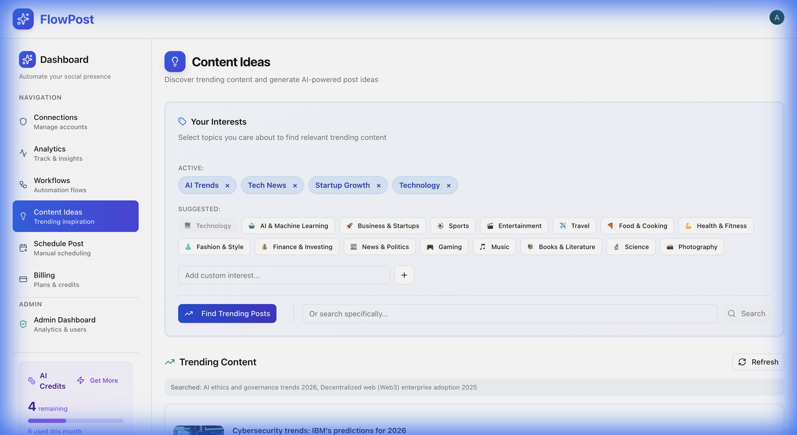
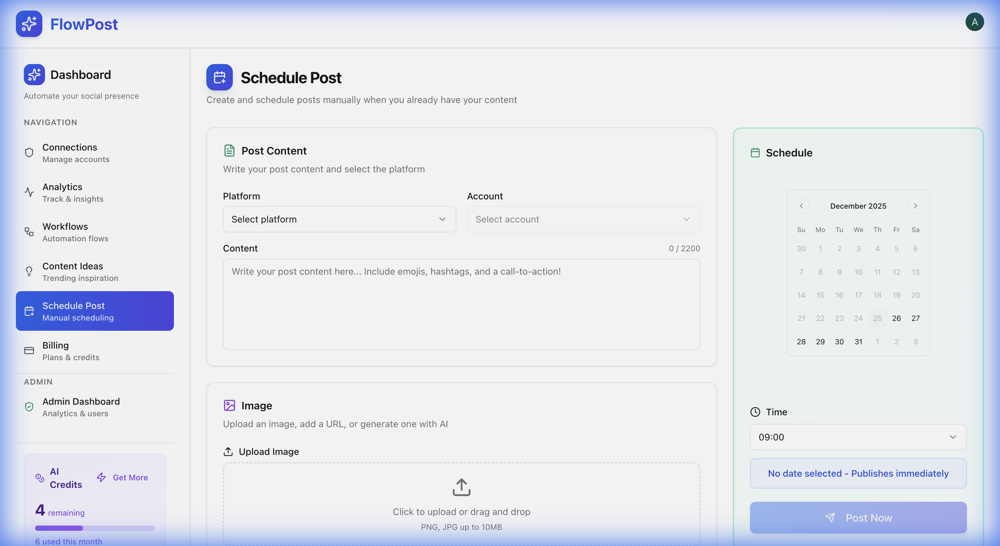
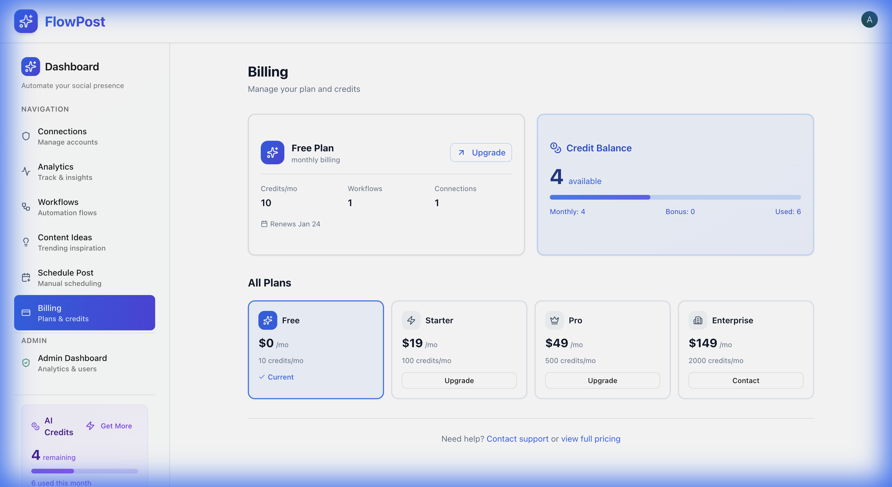
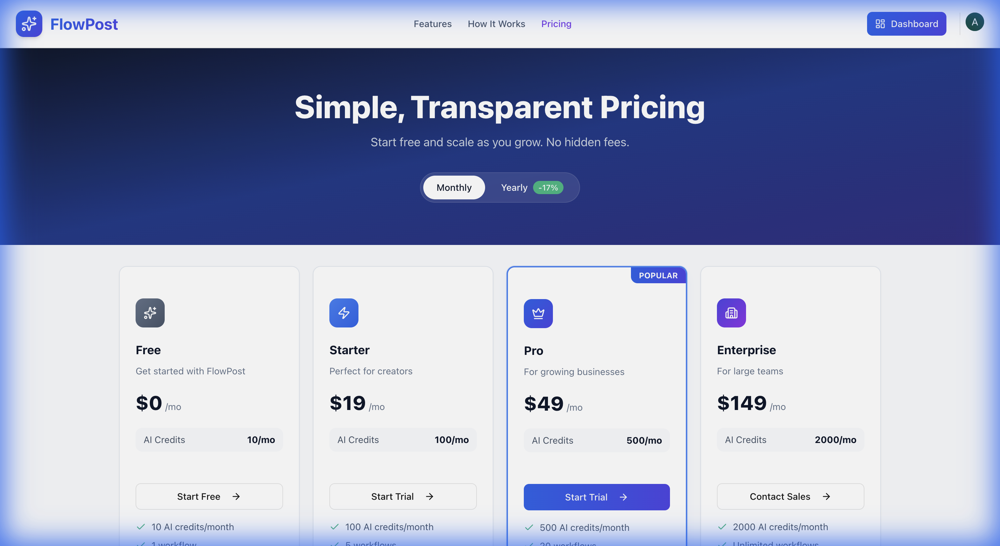
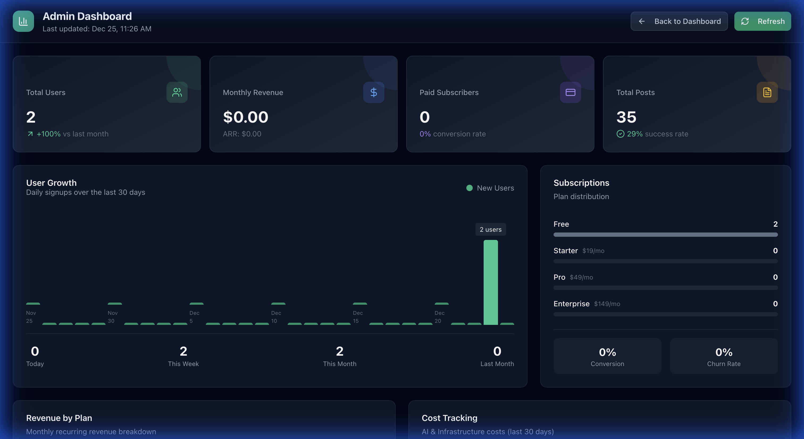

# FlowPost

[](https://github.com/Abby263/flowpost/actions/workflows/ci.yml)
[](https://opensource.org/licenses/MIT)
[](https://www.typescriptlang.org/)
[](https://nextjs.org/)
[](https://github.com/langchain-ai/langgraph)

**AI-Powered Social Media Automation Platform**

FlowPost automates content discovery, image generation with DALL-E 3, and posting to Instagram, Twitter, and LinkedIn. Create custom workflows to maintain a consistent social media presence.


## 📸 Screenshots

<details>
<summary><strong>Click to view all screenshots</strong></summary>

### Landing Page

Beautiful marketing page with feature highlights and pricing information.


### Dashboard - Connections

Manage your social media platform credentials securely.


### Dashboard - Workflows

Create and manage automated content workflows.


### Dashboard - Analytics

Track your post performance with detailed analytics.



### Dashboard - Content Ideas

Get AI-powered content suggestions based on trending topics.



### Dashboard - Schedule Post

Manually schedule posts with AI-generated content.



### Dashboard - Billing

Manage your subscription, credits, and payment methods.



### Pricing Page

View subscription plans and credit packages.



### Admin Dashboard (Admin Only)

Comprehensive analytics for platform administrators.



**Admin Dashboard Features:**

- 📊 User growth analytics with daily signup charts
- 💰 Revenue metrics (MRR, ARR, ARPU)
- 📈 Subscription breakdown by plan
- 💳 Conversion and churn rate tracking
- 🔢 Platform-wide usage statistics
- 💵 Cost tracking for AI APIs
- 📱 Platform usage breakdown (Instagram, Twitter, LinkedIn)
- ⚡ Credit usage monitoring
- 📋 Recent activity feeds

</details>

## Features

- 🤖 **AI Content Discovery** - Find relevant content using Serper API
- 🎨 **AI Image Generation** - Create visuals with DALL-E 3 or Gemini
- 📱 **Multi-Platform Support** - Post to Instagram, Twitter, and LinkedIn
- ⏰ **Smart Scheduling** - Daily, weekly, or monthly automation
- 📊 **Analytics Dashboard** - Track post performance and engagement
- 🔐 **Secure Credentials** - Manage platform credentials via UI
- 💳 **Credit System** - Pay-as-you-go with subscription plans
- 💰 **Stripe Integration** - Secure payment processing
- 💡 **Content Ideas** - AI-powered trending content suggestions
- 👨‍💼 **Admin Dashboard** - Comprehensive platform analytics for admins
- 📈 **Cost Tracking** - Monitor AI API costs and profit margins

## Quick Start

### Prerequisites

- **Node.js 20+** - Required for LangGraph
- **pnpm** - For web UI dependencies (`npm install -g pnpm`)
- [OpenAI API Key](https://platform.openai.com/) - For AI and image generation
- [Serper API Key](https://serper.dev/) - For content discovery
- [Supabase Account](https://supabase.com/) - For database (free tier available)
- [Clerk Account](https://clerk.com/) - For authentication (free tier available)

### Installation

```bash
# Clone and install
git clone https://github.com/Abby263/flowpost.git
cd flowpost
yarn install

# Install frontend dependencies (requires pnpm)
npm install -g pnpm  # If not already installed
cd frontend && pnpm install && cd ..

# Set up environment
cp .env.example .env
# Edit .env with your API keys
```

### Database Setup

1. Create a Supabase project at [supabase.com](https://supabase.com)
2. Go to **SQL Editor** in your dashboard
3. Run the contents of `supabase/schema.sql`
4. Create a storage bucket named `images` (set to public)

### Run the Application

**Option 1: Quick Start (Recommended)**

```bash
# Run both backend and frontend with one command
./run.sh
```

This script automatically:

- Clears ports 54367 and 3000
- Checks and installs dependencies
- Starts LangGraph backend at `http://localhost:54367`
- Starts Next.js frontend at `http://localhost:3000`

**Option 2: Run Separately**

_Terminal 1 - LangGraph Backend:_

```bash
yarn dev
```

Server starts at `http://localhost:54367`

_Terminal 2 - Frontend:_

```bash
cd frontend && pnpm dev
```

App starts at `http://localhost:3000`

**Option 3: Docker Compose**

```bash
docker compose up --build
```

## Environment Variables

Create a `.env` file in the project root:

```bash
# Required
OPENAI_API_KEY=sk-your_key
SERPER_API_KEY=your_key
SUPABASE_URL=https://your-project.supabase.co
SUPABASE_SERVICE_ROLE_KEY=your_key

# Authentication (Clerk)
NEXT_PUBLIC_CLERK_PUBLISHABLE_KEY=pk_your_key
CLERK_SECRET_KEY=sk_your_key
NEXT_PUBLIC_CLERK_SIGN_IN_URL=/sign-in
NEXT_PUBLIC_CLERK_SIGN_UP_URL=/sign-up
NEXT_PUBLIC_CLERK_AFTER_SIGN_IN_URL=/dashboard
NEXT_PUBLIC_CLERK_AFTER_SIGN_UP_URL=/dashboard

# Optional - LangChain Monitoring
LANGCHAIN_API_KEY=your_key
LANGSMITH_TRACING_V2=true

# Optional - Model Configuration
AI_PROVIDER=openai  # or 'gemini'
LLM_MODEL=gpt-4o
IMAGE_MODEL=dall-e-3

# Optional - Stripe (for payments)
STRIPE_SECRET_KEY=sk_your_key
STRIPE_WEBHOOK_SECRET=whsec_your_key
NEXT_PUBLIC_APP_URL=http://localhost:3000

# Optional - Admin Dashboard Access
ADMIN_USER_IDS=user_xxx,user_yyy
NEXT_PUBLIC_ADMIN_USER_IDS=user_xxx,user_yyy

# Optional - Platform Credentials (can add via UI instead)
INSTAGRAM_USERNAME=your_username
INSTAGRAM_PASSWORD=your_password
```

## Usage

### 1. Connect Social Media Accounts

Navigate to **Dashboard > Connections** and add credentials:

- **Instagram**: Username and password
- **Twitter**: API credentials (OAuth tokens)
- **LinkedIn**: Access token


### 2. Create a Workflow

Go to **Dashboard > Workflows** and configure:

1. Select platform (Instagram, Twitter, LinkedIn)
2. Enter search query for content discovery
3. Set location (optional)
4. Choose image style for generation
5. Set schedule (daily, weekly, monthly)


### 3. Run and Monitor

- **Manual Run**: Click "Run Now" to test
- **Automatic**: Scheduled workflows run automatically
- **View Analytics**: Track post performance in the Analytics dashboard

### 4. Get Content Ideas

Visit **Dashboard > Content Ideas** to:

- Get AI-generated content suggestions
- Explore trending topics in your niche
- One-click scheduling of suggested content

### 5. Schedule Posts Manually

Use **Dashboard > Schedule Post** to:

- Create posts with AI-generated content
- Add custom images
- Schedule for optimal posting times

## Admin Dashboard

FlowPost includes a powerful admin dashboard for platform administrators to monitor:

- **User Analytics**: Total users, growth rate, daily signups
- **Revenue Metrics**: MRR, ARR, ARPU, revenue by plan
- **Subscription Stats**: Plan distribution, conversion rate, churn rate
- **Usage Statistics**: Workflows, posts, connections across all users
- **Cost Tracking**: Monitor AI API costs (OpenAI, Anthropic, etc.)
- **Platform Breakdown**: Usage by social media platform
- **Credit Usage**: Platform-wide credit consumption
- **Recent Activity**: Latest subscriptions, posts, and workflows

### Enabling Admin Access

1. Get your Clerk user ID from the [Clerk Dashboard](https://dashboard.clerk.com)
2. Add to your environment variables:
   ```bash
   ADMIN_USER_IDS=user_xxx,user_yyy
   NEXT_PUBLIC_ADMIN_USER_IDS=user_xxx,user_yyy
   ```
3. Admin link appears in the dashboard sidebar for authorized users


## Credit System

FlowPost uses a credit-based system to manage AI usage costs:

### How Credits Work

- **Credits are only deducted on successful completion** - Failed operations don't cost credits
- **Workflow runs**: 1 credit per successful workflow execution
- **Content Ideas**: 1 credit per AI-generated content batch
- **Free tier**: 10 credits per month
- **Purchased credits**: Never expire, carry over

### Subscription Plans

| Plan       | Monthly Price | Credits/Month | Workflows | Connections |
| ---------- | ------------- | ------------- | --------- | ----------- |
| Free       | $0            | 10            | 1         | 1           |
| Starter    | $19           | 100           | 5         | 3           |
| Pro        | $49           | 500           | 20        | 10          |
| Enterprise | $149          | 2000          | Unlimited | Unlimited   |

### Credit Packages (One-time Purchase)

- **Small Pack**: 50 credits + 5 bonus = $9.99
- **Growth Pack**: 150 credits + 15 bonus = $24.99
- **Power Pack**: 500 credits + 75 bonus = $69.99
- **Enterprise Pack**: 2000 credits + 500 bonus = $199.99

### Viewing Credits

Check your credit balance in the sidebar or visit **Dashboard > Billing** for:

- Current credit balance
- Usage history
- Plan details
- Purchase more credits

## Deployment

### Azure Container Apps (One-Command Setup)

Run the setup script to deploy everything:

```bash
./scripts/azure-setup.sh
```

This single script will:

- ✅ Create all Azure resources (Container Registry, Container Apps, etc.)
- ✅ Configure GitHub Actions for CI/CD
- ✅ Build and deploy Docker images
- ✅ Set up automatic deployments on push

**After setup, deployments are automatic:**

- Push to `develop` → Deploys to Dev
- Push to `uat` → Deploys to UAT
- Push to `main` → Deploys to Production

See [docs/AZURE_DEPLOYMENT.md](./docs/AZURE_DEPLOYMENT.md) for detailed documentation.

## Project Structure

```
flowpost/
├── backend/             # LangGraph backend (AI agents)
│   ├── agents/          # LangGraph workflow agents
│   ├── clients/         # Social media platform clients
│   └── utils/           # Utility functions
├── frontend/            # Next.js web dashboard
│   ├── app/             # Next.js App Router pages
│   ├── components/      # React components
│   └── lib/             # Utilities
├── terraform/           # Infrastructure as Code
│   ├── modules/         # Reusable Terraform modules
│   └── environments/    # Environment configs (dev/uat/prod)
├── tests/               # All test files
│   ├── backend/         # Backend unit tests (Jest)
│   ├── frontend/        # Frontend unit tests (Jest)
│   └── e2e/             # E2E tests (Playwright)
├── docs/                # Documentation
├── scripts/             # Operational scripts (crons, backfill)
├── supabase/            # Database schema (run manually)
├── docker-compose.yml   # Local Docker orchestration
└── langgraph.json       # LangGraph configuration
```

For detailed documentation:

- **Backend**: [backend/README.md](./backend/README.md)
- **Frontend**: [frontend/README.md](./frontend/README.md)
- **Terraform**: [terraform/README.md](./terraform/README.md)
- **Deployment**: [docs/AZURE_DEPLOYMENT.md](./docs/AZURE_DEPLOYMENT.md)
- **Tests**: [tests/README.md](./tests/README.md)

## Troubleshooting

**Port already in use**

- Use the `./run.sh` script which automatically clears ports
- Or manually clear: `lsof -ti:3000 | xargs kill -9` and `lsof -ti:54367 | xargs kill -9`

**"Supabase not configured"**

- Ensure `SUPABASE_URL` and `SUPABASE_SERVICE_ROLE_KEY` are set

**"Instagram login failed"**

- Verify credentials are correct
- Try logging in manually to check for security challenges

**"Image generation failed"**

- Check OpenAI API key has DALL-E access
- Verify sufficient API credits

**Frontend dependency install fails**

- Make sure you're using pnpm: `pnpm install` (not yarn or npm)
- Clear node_modules and retry: `rm -rf node_modules && pnpm install`

## License

MIT

---

Built with [LangGraph](https://github.com/langchain-ai/langgraph), [Next.js](https://nextjs.org/), [Supabase](https://supabase.com/), and [Clerk](https://clerk.com/)
