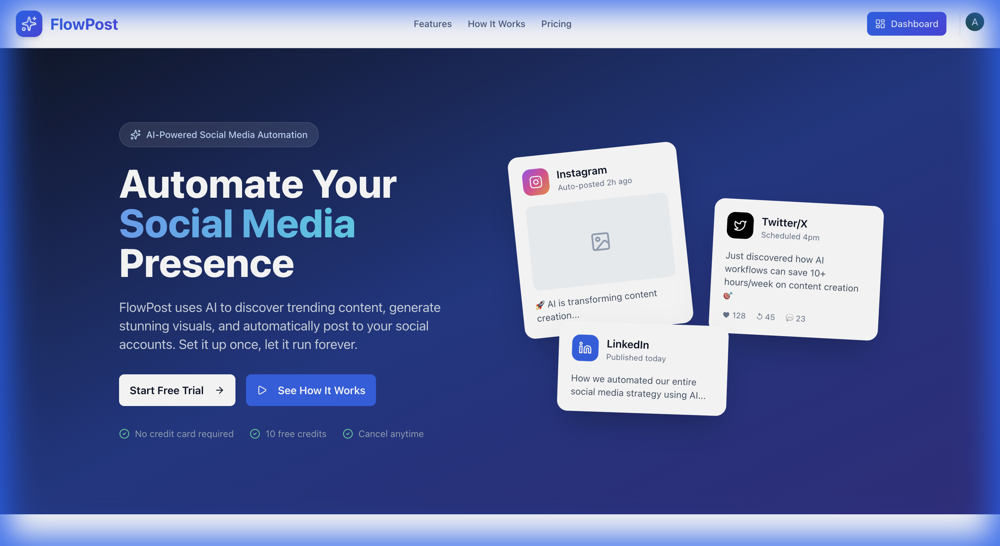
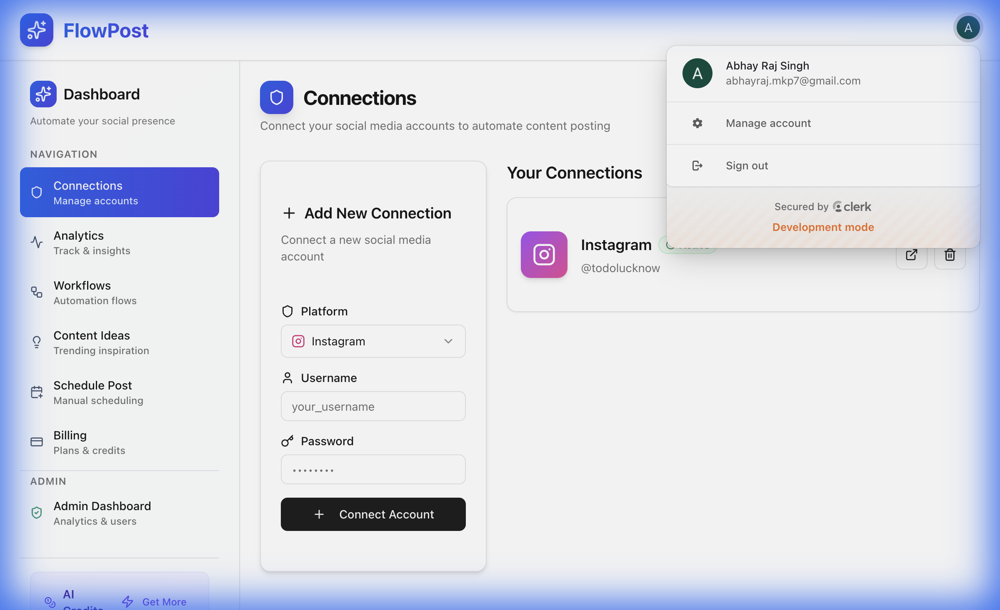
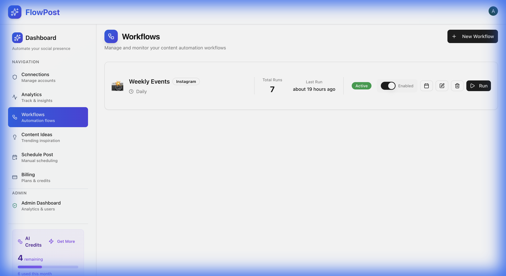
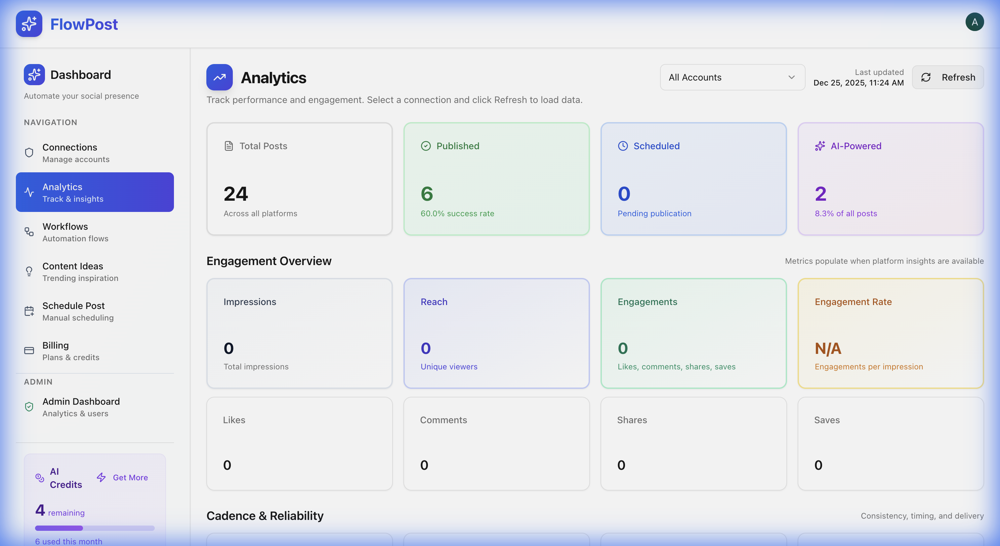
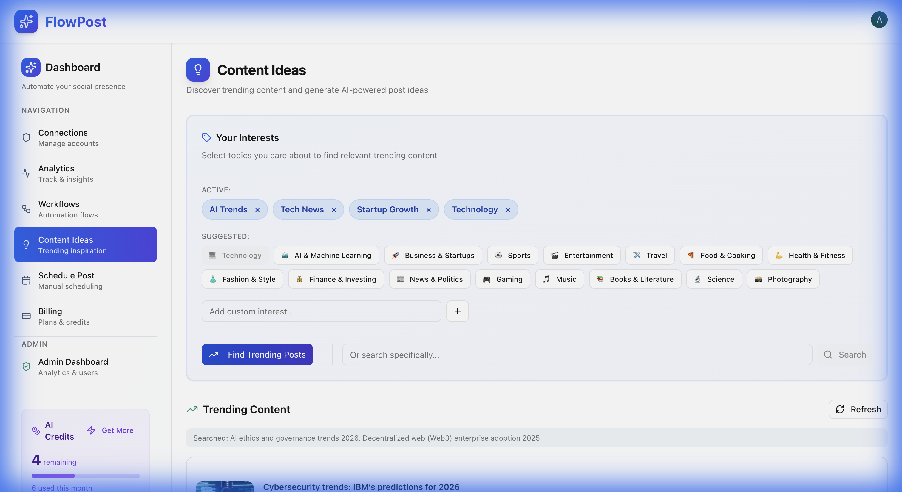
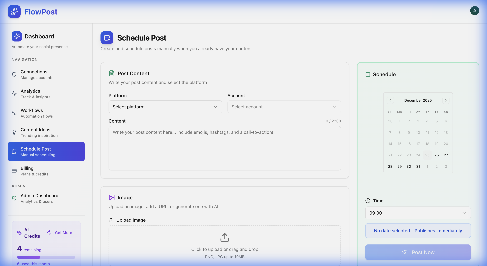
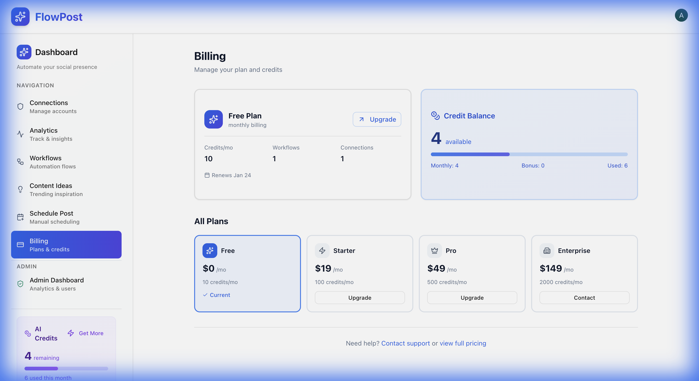
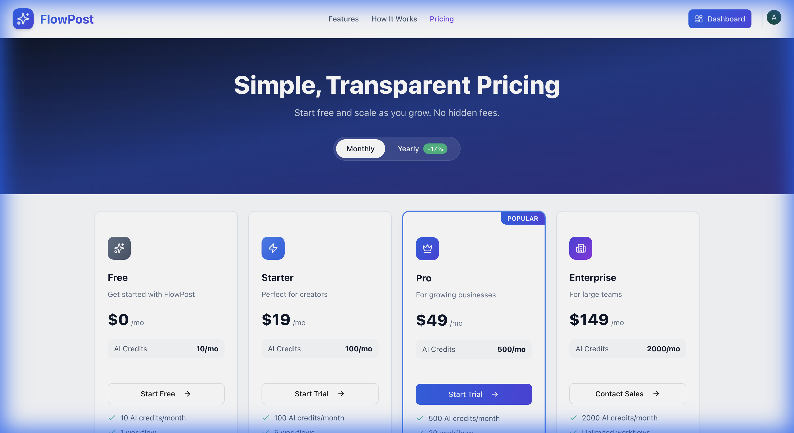
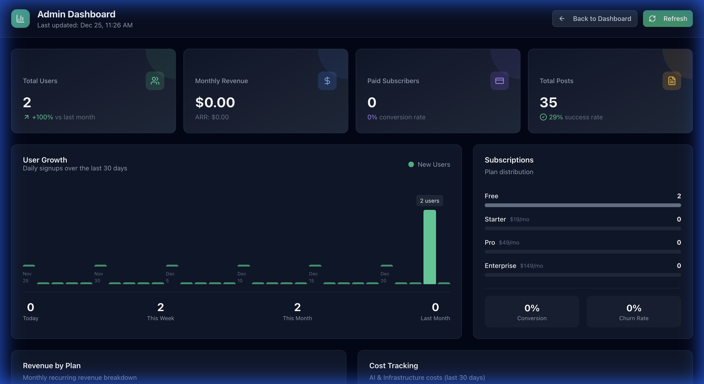

# FlowPost

[](https://github.com/Abby263/flowpost/actions/workflows/ci.yml)
[](https://github.com/Abby263/flowpost/actions/workflows/terraform.yml)
[](https://opensource.org/licenses/MIT)
[](https://www.typescriptlang.org/)
[](https://nextjs.org/)
[](https://github.com/langchain-ai/langgraph)
[](https://azure.microsoft.com/)

**AI-Powered Social Media Automation Platform**

FlowPost automates content discovery, image generation with Gemini, and posting to Instagram, Twitter, and LinkedIn. Create custom workflows to maintain a consistent social media presence.



## 📸 Screenshots

<details>
<summary><strong>Click to view all screenshots</strong></summary>

### Landing Page

Beautiful marketing page with feature highlights and pricing information.


### Dashboard - Connections

Manage your social media platform credentials securely.



### Dashboard - Workflows

Create and manage automated content workflows.



### Dashboard - Analytics

Track your post performance with detailed analytics.



### Dashboard - Content Ideas

Get AI-powered content suggestions based on trending topics.



### Dashboard - Schedule Post

Manually schedule posts with AI-generated content.



### Dashboard - Billing

Manage your subscription, credits, and payment methods.



### Pricing Page

View subscription plans and credit packages.



### Admin Dashboard (Admin Only)

Comprehensive analytics for platform administrators.



**Admin Dashboard Features:**

- 📊 User growth analytics with daily signup charts
- 💰 Revenue metrics (MRR, ARR, ARPU)
- 📈 Subscription breakdown by plan
- 💳 Conversion and churn rate tracking
- 🔢 Platform-wide usage statistics
- 💵 Cost tracking for AI APIs
- 📱 Platform usage breakdown (Instagram, Twitter, LinkedIn)
- ⚡ Credit usage monitoring
- 📋 Recent activity feeds

</details>

## Features

- 🤖 **AI Content Discovery** - Find relevant content using Serper API
- 🎨 **AI Image Generation** - Create visuals with Gemini
- 📱 **Multi-Platform Support** - Post to Instagram, Twitter, and LinkedIn
- ⏰ **Smart Scheduling** - Daily, weekly, or monthly automation
- 📊 **Analytics Dashboard** - Track post performance and engagement
- 🔐 **Secure Credentials** - Manage platform credentials via UI
- 💳 **Credit System** - Pay-as-you-go with subscription plans
- 💰 **Stripe Integration** - Secure payment processing
- 💡 **Content Ideas** - AI-powered trending content suggestions
- 👨‍💼 **Admin Dashboard** - Comprehensive platform analytics for admins
- 📈 **Cost Tracking** - Monitor AI API costs and profit margins
- 🚀 **Blue/Green Deployment** - Zero-downtime deployments with instant rollback
- 🏥 **Health Monitoring** - Startup, liveness, and readiness probes

## Architecture

```
┌─────────────────────────────────────────────────────────────────────────────┐
│                              GitHub Actions                                  │
│  ┌─────────────┐  ┌─────────────┐  ┌─────────────┐  ┌─────────────────────┐ │
│  │     CI      │  │  Terraform  │  │Build & Deploy│  │   Blue/Green       │ │
│  │  (Lint/Test)│  │(Infra as Code│  │   Images    │  │   Traffic Shift    │ │
│  └─────────────┘  └─────────────┘  └─────────────┘  └─────────────────────┘ │
└─────────────────────────────────────────────────────────────────────────────┘
                                      │
                                      ▼
┌─────────────────────────────────────────────────────────────────────────────┐
│                           Azure Infrastructure                               │
│                                                                              │
│  ┌────────────────────────────────────────────────────────────────────────┐ │
│  │                    Azure Container Apps Environment                     │ │
│  │  ┌──────────────────────┐        ┌──────────────────────┐             │ │
│  │  │   Backend (LangGraph)│        │   Frontend (Next.js) │             │ │
│  │  │  ┌────────────────┐  │        │  ┌────────────────┐  │             │ │
│  │  │  │ Health Probes  │  │        │  │ Health Probes  │  │             │ │
│  │  │  │ /health/startup│  │        │  │/api/health/live│  │             │ │
│  │  │  │ /health/live   │  │        │  │/api/health/ready│ │             │ │
│  │  │  │ /health/ready  │  │        │  └────────────────┘  │             │ │
│  │  │  └────────────────┘  │        └──────────────────────┘             │ │
│  │  └──────────────────────┘                                              │ │
│  └────────────────────────────────────────────────────────────────────────┘ │
│                                                                              │
│  ┌─────────────────┐  ┌─────────────────┐  ┌─────────────────────────────┐ │
│  │ Azure Key Vault │  │ Azure PostgreSQL │  │  Azure Container Registry  │ │
│  │  (All Secrets)  │  │ (LangGraph State)│  │    (Docker Images)         │ │
│  └─────────────────┘  └─────────────────┘  └─────────────────────────────┘ │
└─────────────────────────────────────────────────────────────────────────────┘
```

## Quick Start

### Prerequisites

- **Node.js 20+** - Required for LangGraph
- **pnpm** - For web UI dependencies (`npm install -g pnpm`)
- [OpenAI API Key](https://platform.openai.com/) or [Gemini API Key](https://ai.google.dev/) - For AI generation
- [Serper API Key](https://serper.dev/) - For content discovery
- [Clerk Account](https://clerk.com/) - For authentication (free tier available)

### Installation

```bash
# Clone and install
git clone https://github.com/Abby263/flowpost.git
cd flowpost
yarn install

# Install frontend dependencies (requires pnpm)
npm install -g pnpm  # If not already installed
cd frontend && pnpm install && cd ..

# Set up environment
cp .env.example .env
# Edit .env with your API keys
```

### Development Setup (Pre-commit Hooks)

FlowPost uses two systems for code quality checks:

**1. Husky + lint-staged (Auto-installed)**

Automatically runs on every `git commit` for JavaScript/TypeScript files:

- ESLint for linting
- Prettier for formatting

This is set up automatically when you run `yarn install`.

**2. Pre-commit (Manual Setup - Recommended)**

For comprehensive checks including Terraform, Python, security scanning:

```bash
# Install pre-commit (macOS)
brew install pre-commit

# Or with pip
pip install pre-commit

# Install the git hooks
pre-commit install

# (Optional) Run on all files immediately
pre-commit run --all-files
```

**Pre-commit checks include:**

- 🐍 Python: Black, Ruff, MyPy
- 🏗️ Terraform: fmt, tflint, validate, docs
- 🔒 Security: gitleaks (secret detection)
- 📝 General: YAML/JSON validation, trailing whitespace, merge conflicts
- 🐚 Shell: ShellCheck
- 📖 Markdown: markdownlint

**Quick Commands:**

```bash
# Format all code before committing
yarn format                    # Prettier (JS/TS/JSON/MD)
terraform fmt -recursive       # Terraform files

# Check formatting without fixing
yarn format:check
terraform fmt -check -recursive

# Run all pre-commit checks manually
pre-commit run --all-files
```

> **Note:** CI/CD will fail if formatting checks don't pass. Run `yarn format` and `terraform fmt -recursive` before pushing if you haven't set up pre-commit hooks.

### Run the Application

**Option 1: Quick Start (Recommended)**

```bash
# Run both backend and frontend with one command
./run.sh
```

This script automatically:

- Clears ports 54367 and 3000
- Checks and installs dependencies
- Starts LangGraph backend at `http://localhost:54367`
- Starts Next.js frontend at `http://localhost:3000`

**Option 2: Run Separately**

_Terminal 1 - LangGraph Backend:_

```bash
yarn dev
```

Server starts at `http://localhost:54367`

_Terminal 2 - Frontend:_

```bash
cd frontend && pnpm dev
```

App starts at `http://localhost:3000`

**Option 3: Docker Compose**

```bash
docker compose up --build
```

## Environment Variables

Create a `.env` file in the project root:

```bash
# =============================================================================
# AI Providers (at least one required)
# =============================================================================
OPENAI_API_KEY=sk-your_key
GEMINI_API_KEY=your_gemini_key

# =============================================================================
# Content Discovery
# =============================================================================
SERPER_API_KEY=your_key

# =============================================================================
# Authentication (Clerk - Required)
# =============================================================================
NEXT_PUBLIC_CLERK_PUBLISHABLE_KEY=pk_your_key
CLERK_SECRET_KEY=sk_your_key
NEXT_PUBLIC_CLERK_SIGN_IN_URL=/sign-in
NEXT_PUBLIC_CLERK_SIGN_UP_URL=/sign-up
NEXT_PUBLIC_CLERK_AFTER_SIGN_IN_URL=/dashboard
NEXT_PUBLIC_CLERK_AFTER_SIGN_UP_URL=/dashboard

# =============================================================================
# LangGraph API URL (for frontend to connect to backend)
# =============================================================================
LANGGRAPH_API_URL=http://localhost:54367

# =============================================================================
# Optional - LangChain Monitoring
# =============================================================================
LANGCHAIN_API_KEY=your_key
LANGSMITH_TRACING_V2=true

# =============================================================================
# Optional - Model Configuration
# =============================================================================
AI_PROVIDER=gemini  # or 'openai'
LLM_MODEL=gemini-2.0-flash-exp
IMAGE_MODEL=gemini-2.0-flash-exp

# =============================================================================
# Optional - Stripe (for payments)
# =============================================================================
STRIPE_SECRET_KEY=sk_your_key
STRIPE_WEBHOOK_SECRET=whsec_your_key
NEXT_PUBLIC_APP_URL=http://localhost:3000

# =============================================================================
# Optional - Admin Dashboard Access
# =============================================================================
ADMIN_USER_IDS=user_xxx,user_yyy
NEXT_PUBLIC_ADMIN_USER_IDS=user_xxx,user_yyy

# =============================================================================
# Optional - Platform Credentials (can add via UI instead)
# =============================================================================
INSTAGRAM_USERNAME=your_username
INSTAGRAM_PASSWORD=your_password
```

## CI/CD & Deployment

### Environment Strategy

| Trigger           | Environment       | Type               |
| ----------------- | ----------------- | ------------------ |
| Push to `main`    | **dev**           | ✅ Automatic       |
| Push to `develop` | **dev**           | ✅ Automatic       |
| Pull Request      | **dev** (preview) | ✅ Automatic       |
| Tag `v*`          | **uat**           | ⚠️ Manual approval |
| Workflow dispatch | **uat/prod**      | ⚠️ Manual trigger  |

### Blue/Green Deployment

FlowPost uses Blue/Green deployment strategy for zero-downtime releases:

```
1. Deploy new revision (green) → 0% traffic
2. Health check passes → 10% traffic (canary)
3. Monitor metrics → 50% traffic
4. All checks pass → 100% traffic
5. Deactivate old revision (blue)
```

**Instant Rollback:** If issues detected, traffic shifts back to blue immediately.

### Health Probes

Container Apps use health probes to ensure application health:

| Probe         | Backend Path      | Frontend Path         | Purpose           |
| ------------- | ----------------- | --------------------- | ----------------- |
| **Startup**   | `/health/startup` | `/api/health/startup` | App has started   |
| **Liveness**  | `/health/live`    | `/api/health/live`    | App is running    |
| **Readiness** | `/health/ready`   | `/api/health/ready`   | Ready for traffic |

### GitHub Workflows

| Workflow           | Trigger                | Purpose                   |
| ------------------ | ---------------------- | ------------------------- |
| **CI**             | All PRs                | Lint, test, type-check    |
| **Terraform**      | `terraform/**` changes | Infrastructure management |
| **Build & Deploy** | Code changes to `main` | Build images & deploy     |

### Manual Deployment

To deploy infrastructure or trigger a deployment manually:

```bash
# Go to GitHub → Actions → Select Workflow → Run workflow
# Choose environment and action
```

### Azure Infrastructure

Terraform manages all Azure resources:

| Resource                       | Purpose                             |
| ------------------------------ | ----------------------------------- |
| **Resource Group**             | Logical container for all resources |
| **Container Registry**         | Docker image storage                |
| **Container Apps Environment** | Hosting for containers              |
| **Container Apps**             | Backend & Frontend applications     |
| **PostgreSQL Flexible Server** | LangGraph state management          |
| **Key Vault**                  | Centralized secrets storage         |

### Required GitHub Secrets

Add these in **GitHub → Settings → Secrets → Actions**:

```bash
# Azure Service Principal
ARM_CLIENT_ID=xxx
ARM_CLIENT_SECRET=xxx
ARM_SUBSCRIPTION_ID=xxx
ARM_TENANT_ID=xxx
AZURE_CREDENTIALS={"clientId":"...","clientSecret":"...","subscriptionId":"...","tenantId":"..."}

# PostgreSQL
POSTGRES_ADMIN_PASSWORD=your_secure_password

# AI Providers
GEMINI_API_KEY=xxx
OPENAI_API_KEY=xxx  # Optional if using Gemini

# Authentication
CLERK_PUBLISHABLE_KEY=pk_xxx
CLERK_SECRET_KEY=sk_xxx

# Optional
LANGCHAIN_API_KEY=xxx
SERPER_API_KEY=xxx
STRIPE_SECRET_KEY=xxx
STRIPE_WEBHOOK_SECRET=xxx
ADMIN_USER_IDS=user_xxx
```

## Usage

### 1. Connect Social Media Accounts

Navigate to **Dashboard > Connections** and add credentials:

- **Instagram**: Username and password
- **Twitter**: API credentials (OAuth tokens)
- **LinkedIn**: Access token


### 2. Create a Workflow

Go to **Dashboard > Workflows** and configure:

1. Select platform (Instagram, Twitter, LinkedIn)
2. Enter search query for content discovery
3. Set location (optional)
4. Choose image style for generation
5. Set schedule (daily, weekly, monthly)


### 3. Run and Monitor

- **Manual Run**: Click "Run Now" to test
- **Automatic**: Scheduled workflows run automatically
- **View Analytics**: Track post performance in the Analytics dashboard

### 4. Get Content Ideas

Visit **Dashboard > Content Ideas** to:

- Get AI-generated content suggestions
- Explore trending topics in your niche
- One-click scheduling of suggested content

### 5. Schedule Posts Manually

Use **Dashboard > Schedule Post** to:

- Create posts with AI-generated content
- Add custom images
- Schedule for optimal posting times

## Admin Dashboard

FlowPost includes a powerful admin dashboard for platform administrators to monitor:

- **User Analytics**: Total users, growth rate, daily signups
- **Revenue Metrics**: MRR, ARR, ARPU, revenue by plan
- **Subscription Stats**: Plan distribution, conversion rate, churn rate
- **Usage Statistics**: Workflows, posts, connections across all users
- **Cost Tracking**: Monitor AI API costs (OpenAI, Anthropic, etc.)
- **Platform Breakdown**: Usage by social media platform
- **Credit Usage**: Platform-wide credit consumption
- **Recent Activity**: Latest subscriptions, posts, and workflows

### Enabling Admin Access

1. Get your Clerk user ID from the [Clerk Dashboard](https://dashboard.clerk.com)
2. Add to your environment variables:
   ```bash
   ADMIN_USER_IDS=user_xxx,user_yyy
   NEXT_PUBLIC_ADMIN_USER_IDS=user_xxx,user_yyy
   ```
3. Admin link appears in the dashboard sidebar for authorized users


## Credit System

FlowPost uses a credit-based system to manage AI usage costs:

### How Credits Work

- **Credits are only deducted on successful completion** - Failed operations don't cost credits
- **Workflow runs**: 1 credit per successful workflow execution
- **Content Ideas**: 1 credit per AI-generated content batch
- **Free tier**: 10 credits per month
- **Purchased credits**: Never expire, carry over

### Subscription Plans

| Plan       | Monthly Price | Credits/Month | Workflows | Connections |
| ---------- | ------------- | ------------- | --------- | ----------- |
| Free       | $0            | 10            | 1         | 1           |
| Starter    | $19           | 100           | 5         | 3           |
| Pro        | $49           | 500           | 20        | 10          |
| Enterprise | $149          | 2000          | Unlimited | Unlimited   |

### Credit Packages (One-time Purchase)

- **Small Pack**: 50 credits + 5 bonus = $9.99
- **Growth Pack**: 150 credits + 15 bonus = $24.99
- **Power Pack**: 500 credits + 75 bonus = $69.99
- **Enterprise Pack**: 2000 credits + 500 bonus = $199.99

### Viewing Credits

Check your credit balance in the sidebar or visit **Dashboard > Billing** for:

- Current credit balance
- Usage history
- Plan details
- Purchase more credits

## Project Structure

```
flowpost/
├── backend/             # LangGraph backend (AI agents)
│   ├── agents/          # LangGraph workflow agents
│   ├── clients/         # Social media platform clients
│   └── utils/           # Utility functions
├── frontend/            # Next.js web dashboard
│   ├── app/             # Next.js App Router pages
│   │   └── api/health/  # Health probe endpoints
│   ├── components/      # React components
│   └── lib/             # Utilities
├── terraform/           # Infrastructure as Code
│   ├── modules/         # Reusable Terraform modules
│   │   ├── container-app/       # Container App module
│   │   ├── container-environment/  # Environment module
│   │   ├── container-registry/  # ACR module
│   │   ├── key-vault/          # Key Vault module
│   │   └── postgresql/         # PostgreSQL module
│   └── environments/    # Environment configs (dev/uat/prod)
├── .github/workflows/   # CI/CD pipelines
│   ├── ci.yml           # Linting, testing
│   ├── terraform.yml    # Infrastructure management
│   └── deploy.yml       # Build & deploy containers
├── tests/               # All test files
│   ├── backend/         # Backend unit tests (Jest)
│   ├── frontend/        # Frontend unit tests (Jest)
│   └── e2e/             # E2E tests (Playwright)
├── docs/                # Documentation
├── scripts/             # Operational scripts (crons, backfill)
├── docker-compose.yml   # Local Docker orchestration
└── langgraph.json       # LangGraph configuration
```

For detailed documentation:

- **Backend**: [backend/README.md](./backend/README.md)
- **Frontend**: [frontend/README.md](./frontend/README.md)
- **Terraform**: [terraform/README.md](./terraform/README.md)
- **Azure Deployment**: [docs/AZURE_DEPLOYMENT.md](./docs/AZURE_DEPLOYMENT.md)
- **PostgreSQL Integration**: [docs/POSTGRESQL_INTEGRATION.md](./docs/POSTGRESQL_INTEGRATION.md)
- **Tests**: [tests/README.md](./tests/README.md)

## Troubleshooting

**Port already in use**

- Use the `./run.sh` script which automatically clears ports
- Or manually clear: `lsof -ti:3000 | xargs kill -9` and `lsof -ti:54367 | xargs kill -9`

**"Instagram login failed"**

- Verify credentials are correct
- Try logging in manually to check for security challenges

**"Image generation failed"**

- Check Gemini API key configuration
- Verify sufficient API quota

**Frontend dependency install fails**

- Make sure you're using pnpm: `pnpm install` (not yarn or npm)
- Clear node_modules and retry: `rm -rf node_modules && pnpm install`

**Terraform workflow fails**

- Check that all required GitHub secrets are set
- Verify Azure service principal has sufficient permissions
- Run `terraform fmt -recursive` before pushing

**Build workflow fails with ACR not found**

- Ensure Terraform Apply has completed successfully
- Manually trigger the Terraform workflow if needed
- Check Azure Portal to verify resources exist

**Health probes failing**

- Check application logs in Azure Portal
- Verify environment variables are set correctly
- Ensure DATABASE_URI is configured (if using PostgreSQL)

## License

MIT

---

Built with [LangGraph](https://github.com/langchain-ai/langgraph), [Next.js](https://nextjs.org/), [Azure](https://azure.microsoft.com/), and [Clerk](https://clerk.com/)
