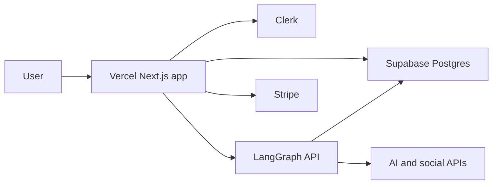

# FlowPost

[](https://github.com/Abby263/flowpost/actions/workflows/ci.yml)

Live app: [https://flowpost.vercel.app](https://flowpost.vercel.app)

FlowPost is an AI-powered social media automation app. It combines a Next.js dashboard, Clerk authentication, Supabase Postgres, and LangGraph workflows for content discovery, generation, scheduling, and publishing.

> **Setting up a fresh deployment? Read [SETUP.md](./SETUP.md).** It walks through Supabase, Clerk, Meta Graph API OAuth, Upstash QStash + Redis, Vercel envs, the QStash sweep schedule, and admin accounts end-to-end. The README below is the short version.

## Product Features

- App-first homepage with a publishing command-center preview.
- Authenticated dashboard overview with setup progress, AI credit balance, workflow status, recent posts, scheduled queue, and quick actions.
- Social account connection management for Instagram, X/Twitter, and LinkedIn.
- Reusable publishing workflows with platform, topic, cadence, approval, and run-status controls.
- Manual post scheduling, AI image generation entry points, content idea generation, analytics cache, billing, and admin views.
- Human-in-the-loop approval inbox: workflows with "Require Approval" enabled save drafts (caption + image) for review at `/dashboard/approvals`. Reject reasons are persisted as negative learnings the agent uses on the next generation.
- Self-improving content loop: a Vercel Cron job pulls Instagram engagement (Meta Graph API) and feeds top/bottom performers back into the prompt for future posts.
- Daily auto-trigger: a second Vercel Cron sweeps active workflows whose cadence is due and starts a run on LangGraph.
- Instagram connect flow uses **Meta Graph API OAuth** (Connect with Facebook) — no username/password is ever stored. Tokens are encrypted at rest with AES-GCM and refreshed automatically before they expire.

## Stack

| Area            | Technology                                         |
| --------------- | -------------------------------------------------- |
| Web app         | Next.js App Router in `frontend/`                  |
| Auth            | Clerk                                              |
| Database        | Supabase Postgres via `DATABASE_URI`               |
| Workflow engine | LangGraph API, configured with `LANGGRAPH_API_URL` |
| Hosting         | Vercel                                             |
| Payments        | Stripe                                             |
| Tests           | Jest, Playwright                                   |

## Architecture


```mermaid
flowchart LR
  user["User"] --> web["Vercel Next.js app"]
  web --> clerk["Clerk"]
  web --> db["Supabase Postgres"]
  web --> lg["LangGraph API"]
  lg --> db
  lg --> providers["AI and social APIs"]
  web --> stripe["Stripe"]
```

The Vercel deployment hosts the frontend and Next.js API routes. Long-running workflow execution remains behind `LANGGRAPH_API_URL`; use LangGraph Cloud or another external LangGraph runtime for that service.

## Local Setup

1. Install root dependencies:

```bash
yarn install --frozen-lockfile
```

2. Install frontend dependencies:

```bash
cd frontend
pnpm install --frozen-lockfile
```

3. Create `.env` at the repo root from `.env.example`.

4. Run the database migrations against Supabase or local Postgres:

```bash
./scripts/run-migration.sh migrations/001_initial_schema.sql
./scripts/run-migration.sh migrations/002_analytics_cache.sql
./scripts/run-migration.sh migrations/003_approvals_learnings_engagement.sql
./scripts/run-migration.sh migrations/004_instagram_oauth.sql
```

5. Start the LangGraph API locally:

```bash
yarn dev
```

6. Start the frontend:

```bash
cd frontend
pnpm dev
```

The frontend runs on `http://localhost:3000`; the local LangGraph API defaults to `http://localhost:54367`.

## Required Environment Variables

Use the Supabase pooled Postgres URL for hosted Vercel deployments to avoid exhausting direct database connections.

```bash
DATABASE_URI=postgresql://postgres.<project-ref>:<password>@<region>.pooler.supabase.com:6543/postgres
POSTGRES_POOL_MAX=1

NEXT_PUBLIC_CLERK_PUBLISHABLE_KEY=pk_test_...
CLERK_SECRET_KEY=sk_test_...
NEXT_PUBLIC_CLERK_SIGN_IN_URL=/sign-in
NEXT_PUBLIC_CLERK_SIGN_UP_URL=/sign-up
NEXT_PUBLIC_CLERK_AFTER_SIGN_IN_URL=/dashboard
NEXT_PUBLIC_CLERK_AFTER_SIGN_UP_URL=/dashboard

LANGGRAPH_API_URL=https://your-langgraph-api.example.com
NEXT_PUBLIC_APP_URL=https://flowpost.vercel.app
```

Optional provider keys include `OPENAI_API_KEY`, `GEMINI_API_KEY`, `LANGCHAIN_API_KEY`, `SERPER_API_KEY`, `FIRECRAWL_API_KEY`, `PERPLEXITY_API_KEY`, and Stripe keys.

Instagram OAuth (required for the IG connection flow):

```bash
META_APP_ID=<your meta app id>
META_APP_SECRET=<your meta app secret>
TOKEN_ENCRYPTION_KEY=<random 32+ char string>     # Used for AES-GCM at-rest encryption of tokens
SUPABASE_URL=https://<project>.supabase.co
SUPABASE_SERVICE_ROLE_KEY=<service-role key>      # Server-side only; never expose
SUPABASE_STORAGE_BUCKET=post-media                # Public bucket for IG image hosting
```

The Meta App must:

- Have the Instagram Graph API product enabled
- Whitelist `${NEXT_PUBLIC_APP_URL}/api/auth/instagram/callback` as an OAuth redirect URI
- Request scopes: `instagram_basic`, `instagram_content_publish`, `instagram_manage_insights`, `pages_show_list`, `pages_read_engagement`, `business_management`
- Pass App Review for those scopes if you want any non-test user to connect

Each connecting user must have an Instagram **Business or Creator** account linked to a Facebook Page they admin. The `post-media` Supabase Storage bucket must exist with **Public access ON** so Meta's servers can fetch image URLs.

Cron-related (production):

```bash
CRON_SECRET=<random-string>          # Vercel Cron auth (also accepts x-vercel-cron header)
```

## Supabase

Create a Supabase project and copy the pooled Postgres connection string from Project Settings → Database → Connection string. Set it as `DATABASE_URI` in local `.env` and in Vercel environment variables. If you assemble the URL manually, URL-encode special characters in the password.

The migration enables row-level security on app tables. The application uses server-side database access through `DATABASE_URI`, so browser clients do not need direct Supabase table access.

## Vercel Deployment

Deploy the `frontend/` directory as the Vercel project root. The project includes `frontend/vercel.json` for Vercel builds.

Production URL: [https://flowpost.vercel.app](https://flowpost.vercel.app)

Required Vercel environment variables:

```bash
DATABASE_URI
POSTGRES_POOL_MAX
NEXT_PUBLIC_CLERK_PUBLISHABLE_KEY
CLERK_SECRET_KEY
NEXT_PUBLIC_CLERK_SIGN_IN_URL
NEXT_PUBLIC_CLERK_SIGN_UP_URL
NEXT_PUBLIC_CLERK_AFTER_SIGN_IN_URL
NEXT_PUBLIC_CLERK_AFTER_SIGN_UP_URL
LANGGRAPH_API_URL
NEXT_PUBLIC_APP_URL
```

Deploy from the CLI:

```bash
cd frontend
npx vercel deploy
```

Promote a verified preview to production:

```bash
npx vercel deploy --prod
```

## Quality Checks

CI runs `yarn typecheck`, `yarn lint`, and unit tests on every PR. Vercel runs the production build separately as a deploy preview. Run the same locally before pushing:

```bash
# Backend (typecheck + lint + jest)
yarn typecheck && yarn lint && yarn test --passWithNoTests

# Frontend (jest + Next.js build)
cd frontend && pnpm test:ci && pnpm build
```

Optional pre-commit hooks (`pre-commit install`) handle prettier + linting locally; not enforced in CI.

## Repository Layout

```text
flowpost/
├── backend/              # LangGraph agents, integrations, utility code
├── frontend/             # Next.js dashboard and API routes
├── migrations/           # Supabase/Postgres SQL migrations
├── scripts/              # Operator scripts (migrations, QStash setup, dev launcher)
├── tests/                # Unit and E2E tests
├── docker/               # Optional local Postgres + LangGraph + frontend stack
├── docs/                 # Long-form docs
└── langgraph.json        # LangGraph graph registry (root for the LangGraph CLI)
```

Local dev launcher:

```bash
./scripts/run-local.sh
```

Docker stack (optional, for an all-in-one local environment):

```bash
docker compose -f docker/docker-compose.yml --project-directory . up --build
```

## Notes

- Keep `POSTGRES_POOL_MAX` low on Vercel. Serverless instances can multiply database connections quickly.
- Keep Clerk keys scoped by environment.
- Keep social platform credentials encrypted or in server-only storage; never expose them as `NEXT_PUBLIC_` values.
- Configure Stripe webhooks to point to `/api/stripe/webhooks` on the deployed Vercel URL.
