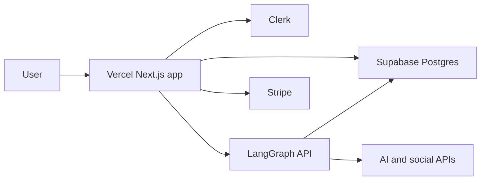

# FlowPost

[](https://github.com/Abby263/flowpost/actions/workflows/ci.yml)
[](https://github.com/Abby263/flowpost/actions/workflows/unit-tests.yml)

Live app: [https://flowpost.vercel.app](https://flowpost.vercel.app)

FlowPost is an AI-powered social media automation app. It combines a Next.js dashboard, Clerk authentication, Supabase Postgres, and LangGraph workflows for content discovery, generation, scheduling, and publishing.

## Stack

| Area            | Technology                                         |
| --------------- | -------------------------------------------------- |
| Web app         | Next.js App Router in `frontend/`                  |
| Auth            | Clerk                                              |
| Database        | Supabase Postgres via `DATABASE_URI`               |
| Workflow engine | LangGraph API, configured with `LANGGRAPH_API_URL` |
| Hosting         | Vercel                                             |
| Payments        | Stripe                                             |
| Tests           | Jest, Playwright                                   |

## Architecture


```mermaid
flowchart LR
  user["User"] --> web["Vercel Next.js app"]
  web --> clerk["Clerk"]
  web --> db["Supabase Postgres"]
  web --> lg["LangGraph API"]
  lg --> db
  lg --> providers["AI and social APIs"]
  web --> stripe["Stripe"]
```

The Vercel deployment hosts the frontend and Next.js API routes. Long-running workflow execution remains behind `LANGGRAPH_API_URL`; use LangGraph Cloud or another external LangGraph runtime for that service.

## Local Setup

1. Install root dependencies:

```bash
yarn install --frozen-lockfile
```

2. Install frontend dependencies:

```bash
cd frontend
pnpm install --frozen-lockfile
```

3. Create `.env` at the repo root from `.env.example`.

4. Run the database migrations against Supabase or local Postgres:

```bash
./scripts/run-migration.sh migrations/001_initial_schema.sql
./scripts/run-migration.sh migrations/002_analytics_cache.sql
```

5. Start the LangGraph API locally:

```bash
yarn dev
```

6. Start the frontend:

```bash
cd frontend
pnpm dev
```

The frontend runs on `http://localhost:3000`; the local LangGraph API defaults to `http://localhost:54367`.

## Required Environment Variables

Use the Supabase pooled Postgres URL for hosted Vercel deployments to avoid exhausting direct database connections.

```bash
DATABASE_URI=postgresql://postgres.<project-ref>:<password>@<region>.pooler.supabase.com:6543/postgres
POSTGRES_POOL_MAX=1

NEXT_PUBLIC_CLERK_PUBLISHABLE_KEY=pk_test_...
CLERK_SECRET_KEY=sk_test_...
NEXT_PUBLIC_CLERK_SIGN_IN_URL=/sign-in
NEXT_PUBLIC_CLERK_SIGN_UP_URL=/sign-up
NEXT_PUBLIC_CLERK_AFTER_SIGN_IN_URL=/dashboard
NEXT_PUBLIC_CLERK_AFTER_SIGN_UP_URL=/dashboard

LANGGRAPH_API_URL=https://your-langgraph-api.example.com
NEXT_PUBLIC_APP_URL=https://flowpost.vercel.app
```

Optional provider keys include `OPENAI_API_KEY`, `GEMINI_API_KEY`, `LANGCHAIN_API_KEY`, `SERPER_API_KEY`, `FIRECRAWL_API_KEY`, `PERPLEXITY_API_KEY`, and Stripe keys.

## Supabase

Create a Supabase project and copy the pooled Postgres connection string from Project Settings → Database → Connection string. Set it as `DATABASE_URI` in local `.env` and in Vercel environment variables. If you assemble the URL manually, URL-encode special characters in the password.

The migration enables row-level security on app tables. The application uses server-side database access through `DATABASE_URI`, so browser clients do not need direct Supabase table access.

## Vercel Deployment

Deploy the `frontend/` directory as the Vercel project root. The project includes `frontend/vercel.json` for Vercel builds.

Production URL: [https://flowpost.vercel.app](https://flowpost.vercel.app)

Required Vercel environment variables:

```bash
DATABASE_URI
POSTGRES_POOL_MAX
NEXT_PUBLIC_CLERK_PUBLISHABLE_KEY
CLERK_SECRET_KEY
NEXT_PUBLIC_CLERK_SIGN_IN_URL
NEXT_PUBLIC_CLERK_SIGN_UP_URL
NEXT_PUBLIC_CLERK_AFTER_SIGN_IN_URL
NEXT_PUBLIC_CLERK_AFTER_SIGN_UP_URL
LANGGRAPH_API_URL
NEXT_PUBLIC_APP_URL
```

Deploy from the CLI:

```bash
cd frontend
npx vercel deploy
```

Promote a verified preview to production:

```bash
npx vercel deploy --prod
```

## Quality Checks

Root backend checks:

```bash
yarn lint
yarn typecheck
yarn test --passWithNoTests
yarn lint:langgraph-json
yarn format:check
```

Frontend checks:

```bash
cd frontend
pnpm lint
pnpm test:ci
pnpm build
```

## Repository Layout

```text
flowpost/
├── backend/              # LangGraph agents, integrations, utility code
├── frontend/             # Next.js dashboard and API routes
├── migrations/           # Supabase/Postgres SQL migrations
├── scripts/              # LangGraph and database helper scripts
├── tests/                # Unit and E2E tests
├── docker-compose.yml    # Optional local Postgres + LangGraph + frontend stack
└── langgraph.json        # LangGraph graph registry
```

## Notes

- Keep `POSTGRES_POOL_MAX` low on Vercel. Serverless instances can multiply database connections quickly.
- Keep Clerk keys scoped by environment.
- Keep social platform credentials encrypted or in server-only storage; never expose them as `NEXT_PUBLIC_` values.
- Configure Stripe webhooks to point to `/api/stripe/webhooks` on the deployed Vercel URL.
